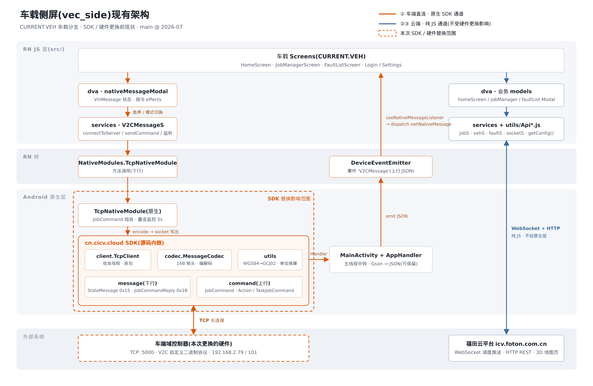
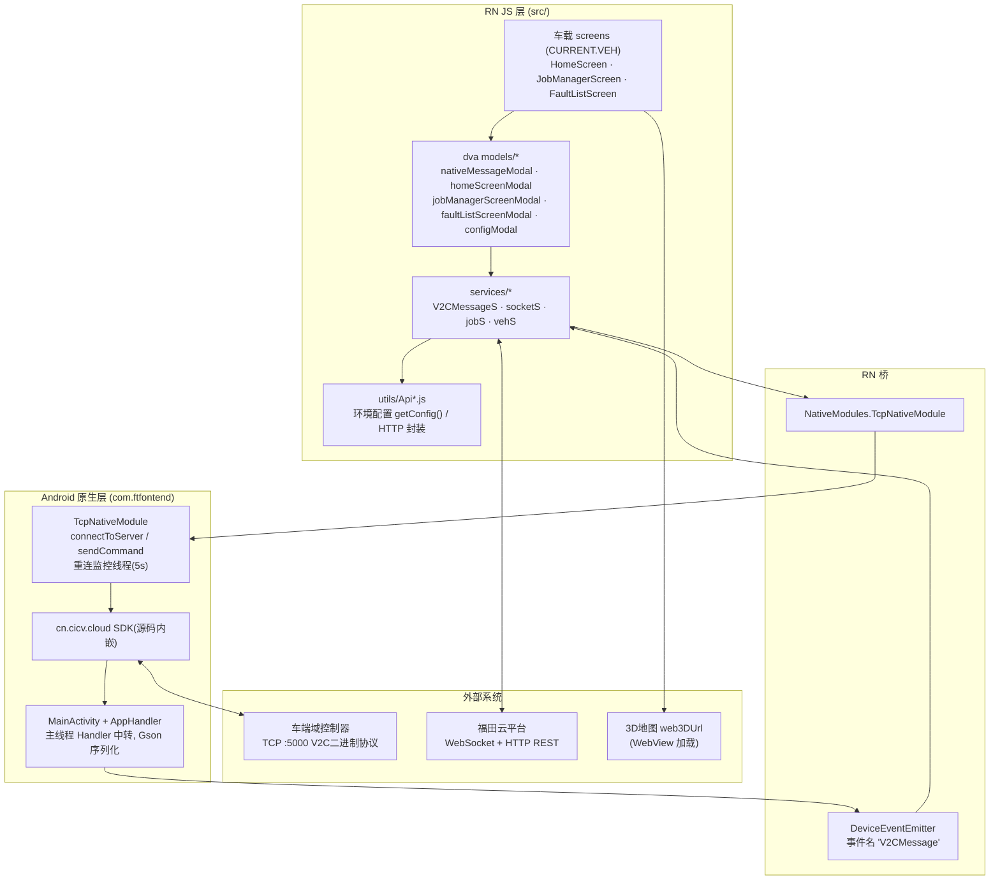
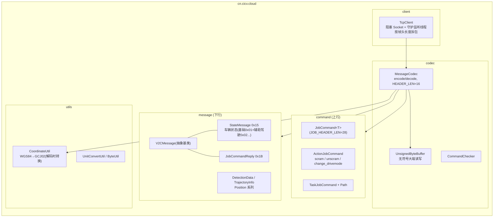
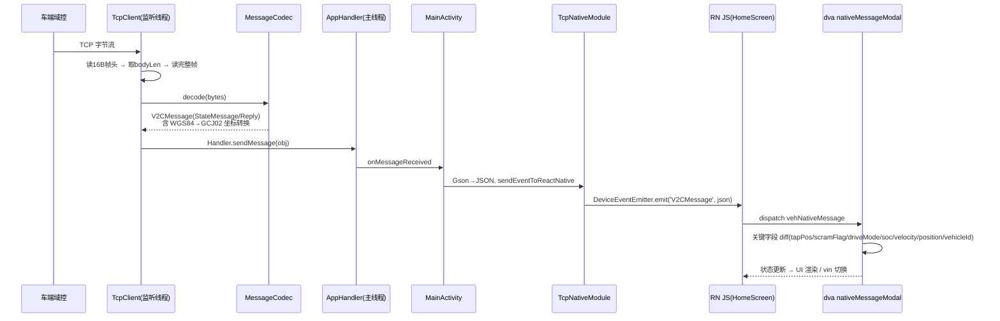

# 车载侧屏(vec_side)现有 SDK 架构

> 目的:SDK / 硬件更换前,把现状架构完整落档,明确替换边界。
> 现状代码基线:main 分支,2026-07。
>
> **范围说明**:本工程同一套代码内含两种运行形态,由 `configModal.currentApp` 切换:`CURRENT.APP`(手持,`*ScreenApp` 页面)与 `CURRENT.VEH`(车载,`HomeScreen / JobManagerScreen / FaultListScreen`)。**本文只覆盖车载 CURRENT.VEH 分支**;原生 TCP SDK 也只被车载分支使用(`HomeScreen` 里调用 `connectToServer()` 并挂 `useNativeMessageListener`)。



## 1. 总体分层

App 共有 **三条数据通道**,其中只有 ① 走原生 SDK,②③ 纯 JS 实现:

| 通道 | 对端 | 协议 | 实现位置 |
|---|---|---|---|
| ① 车端直连 | 车端域控制器 `192.168.2.79/101:5000` | TCP + V2C 自定义二进制协议 | 原生 `cn.cicv.cloud` + `TcpNativeModule` |
| ② 云端实时 | 福田云 `icv.foton.com.cn/foton/job/jobScheduling/realtime/` | WebSocket(JSON,SUB/PING) | `src/services/socketS.js` |
| ③ 云端接口 | 福田云 `foton/job/les`、`foton`(登录) | HTTP REST(axios/fetch,X-Token) | `src/utils/Api*.js` |



## 2. SDK(cn.cicv.cloud)内部结构

SDK 不是 aar/jar,而是**源码直接放在 app module 里**(`android/app/src/main/java/cn/cicv/cloud/`)。



⚠️ **反向耦合**:`TcpClient` 直接 import 了 `com.ftfontend.AppHandler` / `MainActivity`,SDK 与宿主 App 双向依赖,不是干净的 SDK 边界。替换时建议顺手解掉(改为回调接口注入)。

## 3. 下行数据流(车辆状态 → UI)



## 4. 上行指令流(UI → 车辆)

```mermaid
sequenceDiagram
    participant UI as UI(急停/模式切换按钮)
    participant DVA as dva nativeMessageModal
    participant SVC as V2CMessageS.sendCommand
    participant TNM as TcpNativeModule
    participant MC as MessageCodec
    participant V as 车端域控

    UI->>DVA: dispatch sendComandToNative({command})
    DVA->>SVC: sendCommand(currentVin, command)
    SVC->>TNM: NativeModules 调用
    TNM->>TNM: 组装 JobCommand&lt;ActionJobCommand&gt;
    TNM->>MC: encode(jobCommand)
    MC->>V: socket 写出二进制帧
```

支持的指令(硬编码在 `TcpNativeModule.sendCommand` 的 switch 中):

| command 字符串 | action | value | 含义 |
|---|---|---|---|
| sendScramCommand | scram | 0 | 紧急急停 |
| sendUnScramCommand | unscram | 0 | 取消急停 |
| sendChangeDriveMode0Command | change_drivemode | 0 | 人工→自动 |
| sendChangeDriveMode1Command | change_drivemode | 1 | 自动→人工 |

## 5. V2C 协议要点

- **帧头 16 字节**:identifier(1) + bodyLen(4) + type(1) + version(1) + timestamp(8) + controlContent(1),大端、无符号。
- **下行消息类型**:`0x15` StateMessage(车辆状态,version 2/3 追加辅助驾驶/底盘/电池等字段)、`0x1B` JobCommandReply(指令回执)。其他 type 丢弃。
- **上行**:JobCommand 头 28 字节(vehicleId 17B 定长字符串 + seq + jobType + dataLen),体为 ActionJobCommand / TaskJobCommand。
- **默认值约定**:WORD `0xFFFF` / DWORD `0xFFFFFFFF` 表示无效值,JS 层按此判断显示 "--"。
- 解码时 SDK 内完成 **单位换算**(如速度 ×3.6 转 km/h)和 **WGS84→GCJ02 坐标转换**。

## 6. ⚠️ 车机连接地址:实际为固定值(重点)

SDK 本身不写死 IP(`TcpClient(host, port)` 由参数传入),但**地址来源链路最终是固定的**:

- **实际生效地址:`192.168.2.79:5000`**,写死在 `src/utils/Api.js` 的 `proConfig.vcTcp`(`env` 默认 `'pro'`)。
- `SettingsScreen` 虽可运行时修改(`setCurrentEnv`),但**只改内存变量、不落盘(无 AsyncStorage / redux-persist)**,App 重启即还原为写死值 —— 生产上等同于不可改。
- 入口现状:Login 页左下角红色"配置App"按钮(**未包 `__DEV__`,release 包也可见**);个人中心 5 秒内连点 5 次开启 `devMode` 后也有入口。均为调试用途,不改变上面的结论。
- 额外坑:`utils/` 下有 **三份重复配置**(`Api.js`、`Api axios.js`、`Api fetch.js`),默认 IP 还不一致(`.79` vs `.101`);实际生效的只有 `Api.js`(services 均 `from '../utils/Api'` 导入),另两份为废弃副本,改错文件不生效。
- `cn.cicv.cloud/Main.java` 里写死的 `61721pi2ip51.vicp.fun:45046` 是控制台测试入口,App 运行时不会执行,属死代码。

**对本次更换的影响**:新硬件的连接地址若与 `192.168.2.79:5000` 不同,**必须改代码重新打包**。建议随替换一并改造:连接参数持久化(AsyncStorage / redux-persist)+ 写死默认值兜底;若新硬件支持,优先考虑设备发现机制,避免逐台刷包配 IP。

## 7. 替换边界(换 SDK / 换硬件时动哪里)

对 RN JS 层来说,原生侧的稳定契约只有 **3 个接口**:

1. `TcpNativeModule.connectToServer(host, port)`
2. `TcpNativeModule.sendCommand(vehicleId, command)` — command 为上表 4 个字符串
3. `DeviceEventEmitter` 事件 `'V2CMessage'` — 值为 StateMessage 的 JSON 字符串,JS 依赖其中字段名(见 `nativeMessageModal.js` 的 testVinMessage:vehicleId / driveMode / soc / velocity / position{latitude,longitude} / tapPos / scramFlag / remoteScramFlag / vehFault 等)

**只要新 SDK 适配层保住这 3 个契约(方法名、事件名、JSON 字段名),JS 层可零改动**;需要替换的是:

- `cn.cicv.cloud` 整包(协议编解码 + TcpClient)
- `TcpNativeModule` 中与旧 SDK 耦合的部分(JobCommand 组装、TcpClient 持有、重连逻辑)
- `MainActivity/AppHandler` 的消息中转(可保留,只换消息来源)
- `utils/Api.js` 中的 `vcTcp/vcTcpPort` 配置(若新硬件不再是 TCP 直连则需重新设计)

已知技术债(建议随替换一并处理):

- SDK 反向依赖宿主(TcpClient → MainActivity.appHandler),应改为监听器注入
- `MainActivity.appHandler`、`TcpNativePackage.tcpNativeModule` 均为静态单例
- 重连逻辑分散在 connectToServer 的 catch(1s 重试)与 monitor 线程(5s 轮询)两处
- 指令 seq 写死 122222,actionLen 手工硬编码
